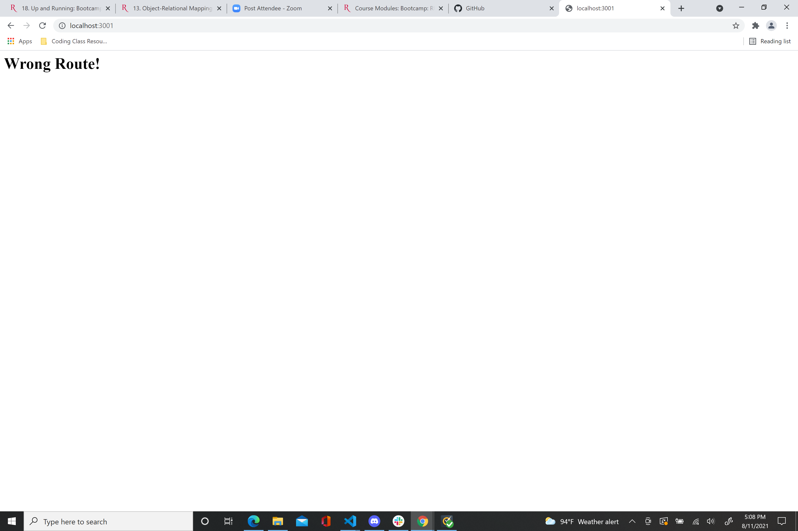
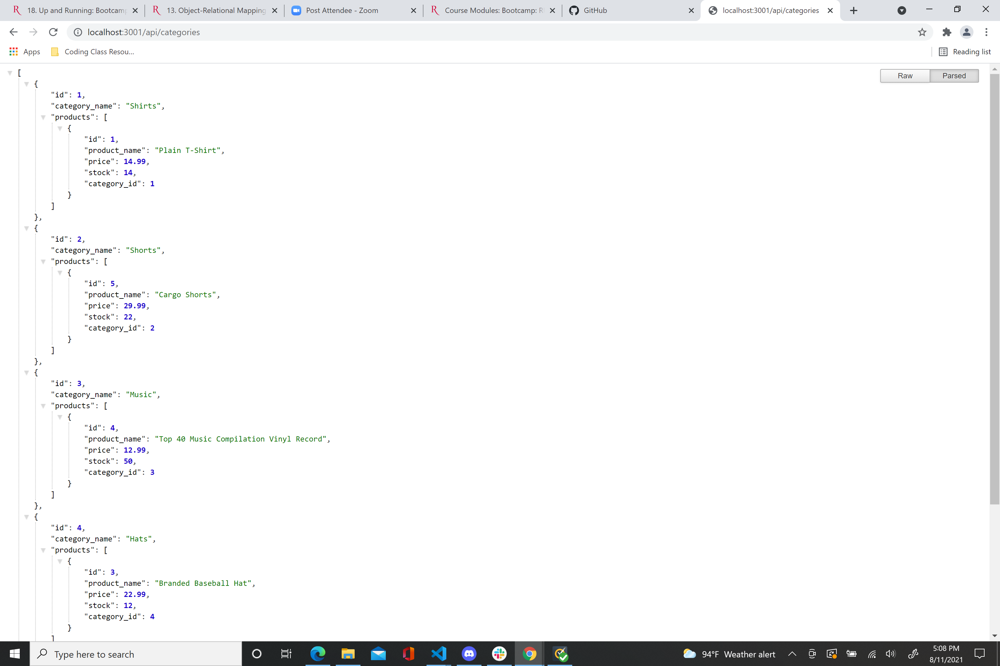
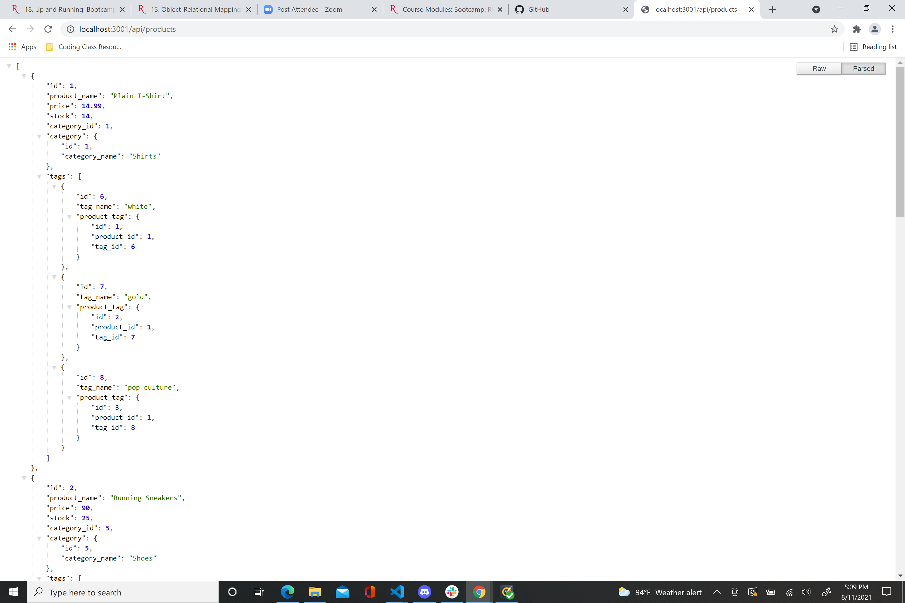
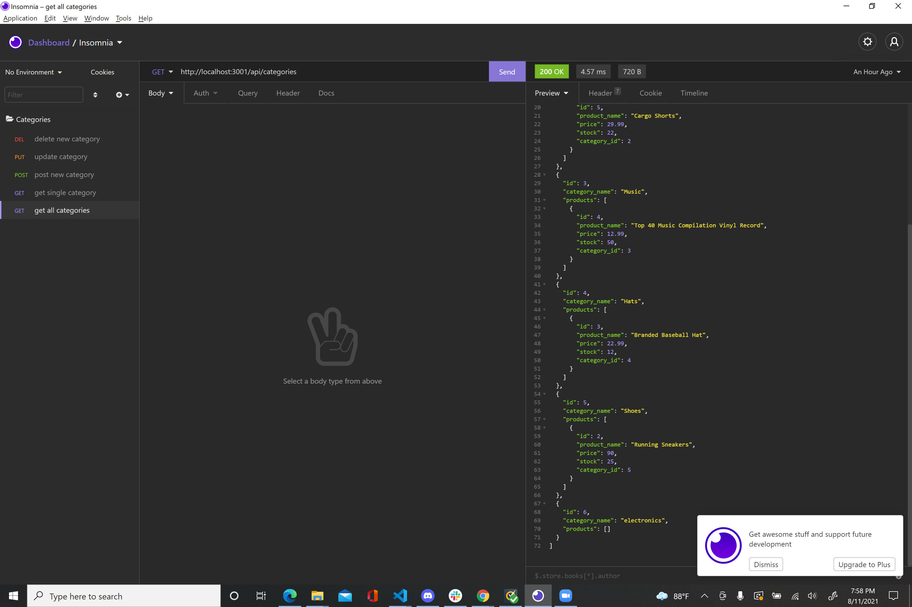
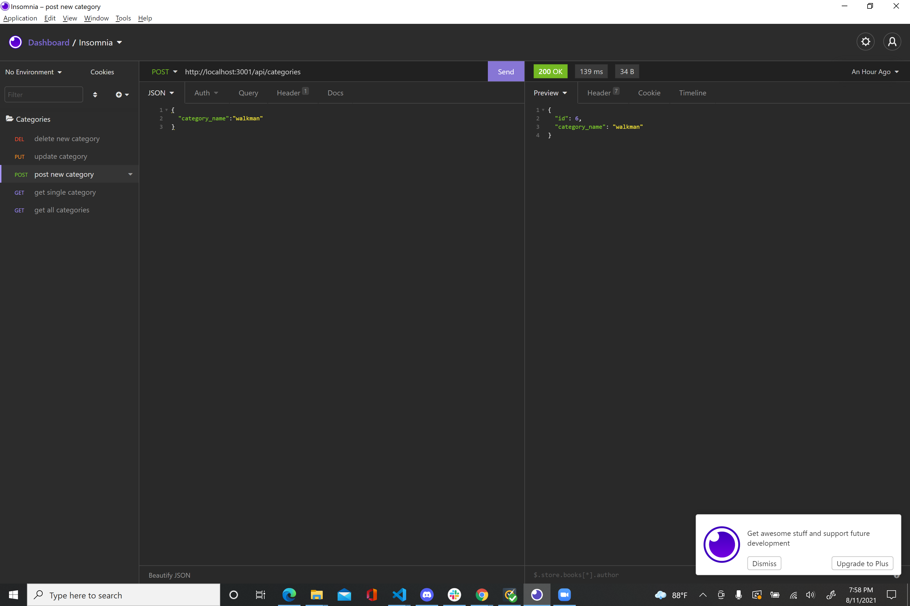

# E-commerce Back End Starter Code
We were tasked with building the back end for an e-commerce web site. This website was created by having Sequilze run with the Express.js Api so that it can pull data from the MySql database.

Usage-
1.Type npm run seed in terminal
2.Type node server.js in terminal
3. Go to localhost:3001

Screenshots-
1. 
2. 
3. 
4. 
5. 

Video link-
I also included a video link of me using the database
https://drive.google.com/file/d/1rVdJYaCqBg6k66rQ0LHDsv10RMI3OyvT/view